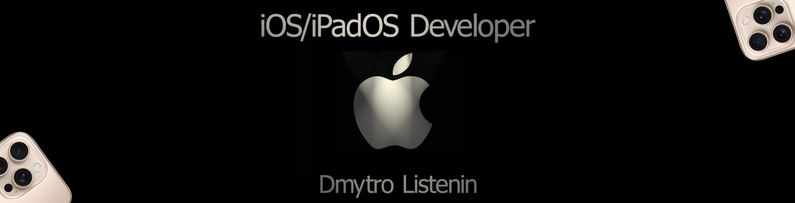

##

# 🔱 Languages and Tools

##

# 🔱 Other Skills, App Architecture

##
##
# 🔱 About me 
⚜️I am a passionate and motivated iOS developer with experience in building apps using Swift, SwiftUI, and UIKit. I enjoy crafting user-friendly and functional applications while continuously improving my coding skills and exploring new technologies.

🔆Currently, I am focused on creating innovative projects to enhance my portfolio and demonstrate my abilities to potential employers. My goal is to work as part of a dynamic team, contribute to impactful projects, and eventually grow into a senior developer role.

🔅When I’m not coding, I enjoy exploring technology trends, solving challenges, and learning about product design to improve the user experience in my apps.
##

# My Background
Before specializing in iOS development, I explored various programming languages and technologies, including:

__

Java: Learned basic syntax and object-oriented programming concepts. Although some time has passed, I believe I could quickly refresh this knowledge if needed.

__

JavaScript: Developed small web applications and interactive elements.

HTML & CSS: Practiced creating responsive designs and web layouts.

__

This experience has provided me with a strong foundation in programming concepts, which I now leverage in my journey as an iOS developer.
##

